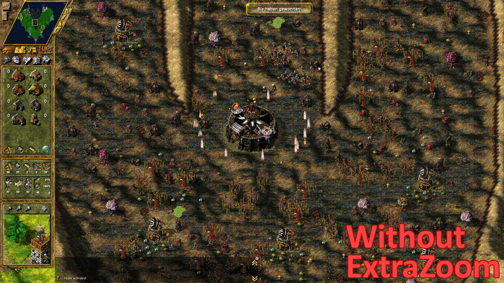
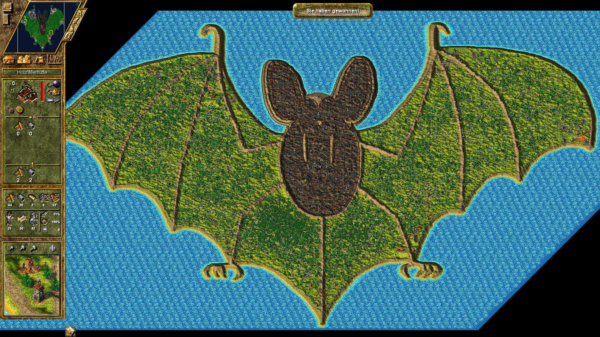

# Die Siedler 4: ExtraZoom Plugin

Standardmäßig kann im Spiel Die Siedler 4 nicht besonders weit rausgezoomt werden. Dieses Script erlaubt es dir das Limit beliebig zu verändern.

Für dieses README gibt es eine [englische Version](README.md). Bitte beachte, dass die deutsche Übersetzung ggf. veraltet sein kann.

## Features

* Erweitert die Zoomfähigkeit des Spiels um größere Ausschnitte der Welt betrachten zu können.
* Das Limit ist über eine Konfigurationsdatei einstellbar.
* Kompatibilität: Die Mod läuft sowohl mit der Gold Edition als auch der History Edition von Die Siedler 4.
* Multiplayerfähig: Du kannst Partien mit Teilnehmern spielen, die das Plugin nicht verwenden. Keine DESYNCS!
* Weitere Bugfixes:
  * Ein potentieller crash (verursacht durch einen nicht-terminierenden Algorithmus) im Zusammenhang mit dem Zoomen/Scrollen wurde behoben.
  * Du kannst nun die Kamera an jede beliebige Position der Karte zu bewegen. 

## Installation

Du benötigst einen ASI Loader um die Mod zu nutzen. Ich empfehle den [The Settlers 4: ASI Loader](https://github.com/nyfrk/Settlers4-ASI-Loader), da er gut mit der Gold und History Edition von Die Siedler 4 funktioniert und keinerlei Konfiguration erfordert. 

1. Lade eine Version des [ExtraZoom Plugins](https://github.com/nyfrk/Settlers4-ExtraZoom/releases) herunter.
2. Entpacke die Dateien in dein `plugins` Verzeichnis.
3. Starte das Spiel. Die Mod sollte nun automatisch geladen werden.

Um die Mod zu deinstallieren, entferne die `ExtraZoom.asi` aus dem `plugins`-Verzeichnis. 

#### Eigenes Limit festlegen

Öffne die ExtraZoom.ini um das Limit nach belieben anzupassen. Beachte, dass es sehr rechenaufwändig ist viele Objekte auf einmal dazustellen. Aus diesem Grund solltest du es nicht übertreiben. Da das Spiel keine moderne Hardwareunterstützung hat, werden selbst leistungsstarke Rechner Probleme bekommen, wenn das Zoomlimit zu stark erhöht wird. Durch ein benutzerdefiniertes Limit kann folgende Zoomstufe erreicht werden:

(eine Karte der Größe 1024x1024, betrachtet mit der größten Zoomstufe: 6)

## Bekannte Probleme

* Wenn du mit der rechten+linken Maustaste zoomst, wirst du eine Verschlechterung des Zoomverhaltens feststellen. I würde nicht empfehlen diese Methode zum Zoomen zu verwenden und stattdessen ein Mausrad verwenden. Ich denke, dass heutzutage jeder eine Maus mit Mausrad hat und daher niemand die alternative Methode verwendet. Aus diesem Grund habe ich kein Fix dafür eingebaut. [Öffne ein Ticket](https://github.com/nyfrk/Settlers4-ExtraZoom/issues), falls du einer der Nutzer bist, die tatsächlich die alternative Methode zum Zoomen verwenden. Wir können dann eine Lösung ausarbeiten.

## Probleme und Fragen

Das Projekt verwendet den Github Issue Tracker. Bitte öffne [hier](https://github.com/nyfrk/Settlers4-ExtraZoom/issues) ein Ticket für dein Anliegen. 

## Mitmachen

Das offizielle Repository dieses Projekts ist unter https://github.com/nyfrk/Settlers4-ExtraZoom verfügbar. 

##### Kompilieren

Lade Visual Studio 2017 oder 2019 mit der C++-Toolchain herunter. Das Projekt ist so konfiguriert, dass es mit der Windows XP-kompatiblen **v141_xp**-Toolchain gebaut wird. Du solltest jedoch die Toolchain nach Belieben ändern können. Es sind keine zusätzlichen Bibliotheken erforderlich, sodass das Projekt ohne weiteres gebaut werden kann. 

## Lizenz

Das Projekt ist unter der [MIT](LICENSE.md)-Lizenz lizenziert. 
